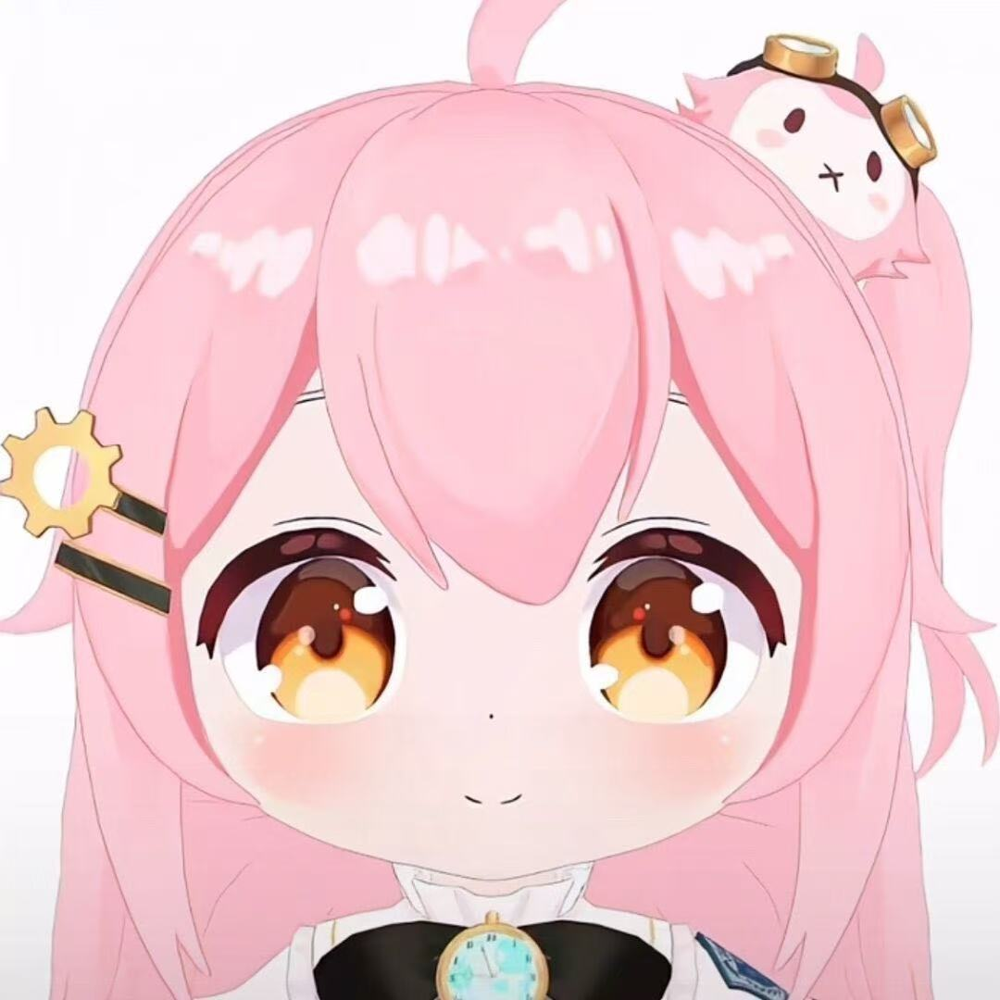

<!DOCTYPE html>
<html lang="en">
<head>
    <meta charset="UTF-8">
    <meta name="viewport" content="width=device-width, initial-scale=1.0">
    <title>C3-3 · CPT208 Group</title>
    
</head>
<body>
    

        <!-- Group Header -->
        <h1>C3-3 · CPT208 Group</h1>
        

            Interaction Design · Discovering Requirements
        

        Go Training APP
        <section>
            <h2>Project Goal</h2>
            

                
📌 Develop an interactive platform that helps university students efficiently find study partners, share learning resources, and collaborate on academic projects in a distraction‑free environment.

            

        </section>
        <!-- Team Members -->
        <section>
            <h2>Team Members</h2>
            

                <!-- Zicheng Niu -->
                

                    
                    
Zicheng Niu

                    
2362392

                    
Front-end Developer

                    
Passionate about creating responsive and accessible interfaces.

                

                <!-- Weiyi Zheng -->
                

                    
                    
Weiyi Zheng

                    
2361878

                    
UX Researcher

                    
Enjoys conducting user interviews and translating insights into design.

                

                <!-- Linghui Zhu -->
                

                    
                    
Linghui Zhu

                    
2363060

                    
UI Designer

                    
Focused on visual design and prototyping with Figma.

                

                <!-- Mariia Starostina -->
                

                    
                    
Mariia Starostina

                    
2583073

                    
Back-end Developer

                    
Experienced in database management and API integration.

                

            

        </section>
        goal users
        <section>
            <h2>User Personas</h2>
            

                <!-- Persona 1 -->
                

                    

                        
                        
Wang Xiaoming

                        
22 · University Student (Computer Science)

                    

                    

                        

                            <h4>Background</h4>
                            
Third‑year undergrad who loves learning new tech skills through mobile apps. Active on online forums but finds them too noisy.

                        

                        

                        

                            <h4>Goals</h4>
                            
Quickly find like‑minded study partners for coding projects and exam prep.

                        

                        

                        

                            <h4>Pain Points</h4>
                            
Existing platforms are cluttered with irrelevant content; matching is imprecise and time‑consuming.

                        

                        

                        

                            <h4>Behaviour</h4>
                            
Studies late at night, prefers minimalistic interfaces, and relies on push notifications.

                        

                    

                

                <!-- Persona 2 -->
                

                    

                        
                        
Li Fang

                        
35 · High School Teacher

                    

                    

                        

                            <h4>Background</h4>
                            
Busy teacher aiming to improve her teaching skills during spare time. Frequently uses a tablet for learning.

                        

                        

                        

                            <h4>Goals</h4>
                            
Access high‑quality teaching resources and exchange ideas with fellow educators.

                        

                        

                        

                            <h4>Pain Points</h4>
                            
Too little time to filter through massive content; needs personalised recommendations.

                        

                        

                        

                            <h4>Behaviour</h4>
                            
Uses iPad during commute, prefers video tutorials and concise summaries.

                        

                    

                

            

        </section>
        <!-- Footer -->
        

            C3-3 · Interaction Design · 2026
        

    

    <!-- 
        INSTRUCTIONS:
        1. Create an 'images' folder in your repository.
        2. Place member photos as: zicheng.jpg, weiyi.jpg, linghui.jpg, mariia.jpg.
        3. Place persona photos as: persona1.jpg, persona2.jpg (or rename src accordingly).
        4. Update the project goal, member roles/bios, and persona details to match your actual project.
        5. Commit and push; your page will be available at https://<username>.github.io
    -->
</body>
</html>
